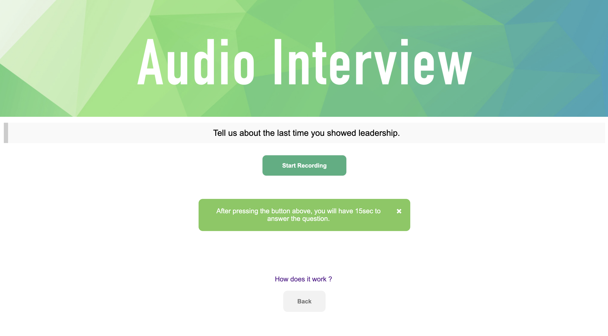
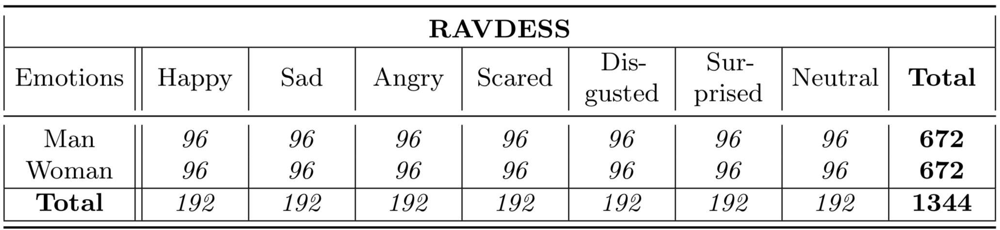

# Speech Emotion Recognition




The aim of this section is to explore speech emotion recognition techniques from an audio recording.

## Data

The data set used for training is the **Ryerson Audio-Visual Database of Emotional Speech and Song**: https://zenodo.org/record/1188976#.XA48aC17Q1J

 **RAVDESS** contains 24 professional actors (12 female, 12 male), vocalizing two lexically-matched statements in a neutral North American accent. Speech includes calm, happy, sad, angry, fearful, surprise, and disgust expressions, and song contains calm, happy, sad, angry, and fearful emotions. Each expression is produced at two levels of emotional intensity (normal, strong), with an additional neutral expression.

 

| Data | Processed Data for training | Processed Data for training | Pre-trained TimeDistributed CNNs model|
|:----:|:---------------------------:|:---------------------------:|:-------------------------------------:|
| [RAVDESS](https://drive.google.com/file/d/1OL2Kx9dPdeZWoue6ofHcUNs5jwpfh4Fc/view?usp=sharing) | [X-train](https://drive.google.com/file/d/1qv-y0FhaRy5Np8DF3a8Xty8xLvvv4QH4/view?usp=sharing) [y-train](https://drive.google.com/file/d/1y5j43I09Xe6RHK8BsHP8_ZNkUuTehhgY/view?usp=sharing) | [X-test](https://drive.google.com/file/d/1MN1Fxc_sDR1ZDQmPdFMwlnhP4qn9d8bT/view?usp=sharing) [y-test](https://drive.google.com/file/d/1ovvCXumkEP1oLxErgMgyIg1Z1Eih430W/view?usp=sharing)| [Weights](https://drive.google.com/file/d/1pQ5QahXJ3dPDXhyPkQ7rS1fOHWKHcIdX/view?usp=sharing) [Model](https://drive.google.com/file/d/1TuKN2PbFvoClaobL3aOW1KmA0e2eEc-O/view?usp=sharing) | [Colab Notebook](https://colab.research.google.com/drive/1EY8m7uj3BzU-OsjAPGBqoapw1OSUHhum)|


## Requirements

```
Python : 3.6.5
Scipy : 1.1.0
Scikit-learn : 0.20.1
Tensorflow : 1.12.0
Keras : 2.2.4
Numpy : 1.15.4
Librosa : 0.6.3
Pyaudio : 0.2.11
Ffmpeg : 4.0.2
```


## Files

The different files that can be found in this repo :
- `Model` : Saved models (SVM and TimeDistributed CNNs)
- `Notebook` : All notebooks (preprocessing and model training)
- `Python` : Personal audio library
- `Images`: Set of pictures saved from the notebooks and final report
- `Resources` : Some resources on Speech Emotion Recognition

Notebooks provided on this repo:
- `01 - Preprocessing[SVM].ipynb` : Signal preprocessing and feature extraction from time and frequency domain (global statistics) to train SVM classifier.
- `02 - Train [SVM].ipynb` : Implementation and training of SVM classifier for Speech Emotion Recognition
- `01 - Preprocessing[CNN-LSTM].ipynb` :  Signal preprocessing and log-mel-spectrogram extraction to train TimeDistributed CNNs
- `02 - Train [CNN-LSTM].ipynb` : Implementation and training of TimeDistributed CNNs classifier for Speech Emotion Recognition


## Models

### SVM

Classical approach for Speech Emotion Recognition consists in applying a series of filters on the audio signal and partitioning it into several windows (fixed size and time-step). Then, features from time domain (**Zero Crossing Rate, Energy** and **Entropy of Energy**) and frequency domain (**Spectral entropy, centroid, spread, flux, rolloff** and **MFCCs**) are extracted for each frame. We compute then the first derivatives of each of those features to capture frame to frame changes in the signal. Finally, we calculate the following global statistics on these features: *mean, median, standard deviation, kurtosis, skewness, 1% percentile, 99% percentile, min, max* and *range* and train a simple SVM classifier with rbf kernel to predict the emotion detected in the voice.

 

SVM classification pipeline:
- Voice recording
- Audio signal discretization
- Apply pre-emphasis filter
- Framing using a rolling window
- Apply Hamming filter
- Feature extraction
- Compute global statistics
- Make a prediction using our pre-trained model


### TimeDistributed CNNs

The main idea of a **Time Distributed Convolutional Neural Network** is to apply a rolling window (fixed size and time-step) all along the log-mel-spectrogram. Each of these windows will be the entry of a convolutional neural network, composed by four Local Feature Learning Blocks (LFLBs) and the output of each of these convolutional networks will be fed into a recurrent neural network composed by 2 cells LSTM (Long Short Term Memory) to learn the long-term contextual dependencies. Finally, a fully connected layer with *softmax* activation is used to predict the emotion detected in the voice.

 

TimeDistributed CNNs pipeline:
- Voice recording
- Audio signal discretization
- Log-mel-spectrogram extraction
- Split spectrogram with a rolling window
- Make a prediction using our pre-trained model


## Performance

To limit overfitting during training phase, we split our data set into train (80%) and test set (20%). Following show results obtained on test set:

|       Model                             |   Accuracy    |
|-----------------------------------------|---------------|
| SVM on global statistic features        |     68,3%     |
| Time distributed CNNs                   |     76,6%     |
