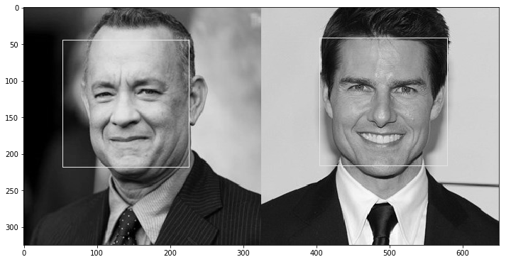
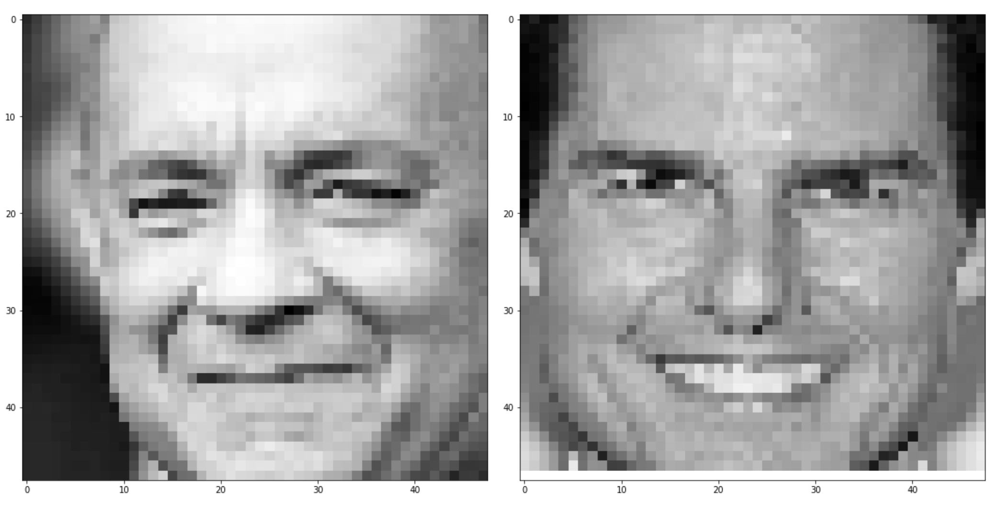

# Facial Emotion Recognition

The aim of this section is to explore facial emotion recognition techniques from a live webcam video stream.


## Data

The data set used for training is the **Kaggle FER2013** emotion recognition data set : https://www.kaggle.com/c/challenges-in-representation-learning-facial-expression-recognition-challenge/data

The data consists of 48x48 pixel grayscale images of faces. The faces have been automatically registered so that the face is more or less centered and occupies about the same amount of space in each image. The task is to categorize each face based on the emotion shown in the facial expression in to one of seven categories (0=Angry, 1=Disgust, 2=Fear, 3=Happy, 4=Sad, 5=Surprise, 6=Neutral).


## Requirements

```
Python : 3.6.5
Tensorflow : 1.10.1
Keras : 2.2.2
Numpy : 1.15.4
OpenCV : 4.0.0
```


## Files

The different files that can be found in this repo :
- `Notebook_Images` : A set of pictures saved from the notebooks for the final report
- `Test_Images` : A set of pictures used to test the pipeline of image treatment
- `Model_Images` : Models structures saved using `plot_model`
- `Resources` : Some resources that have to used to build the notebooks
- `Other_Notebooks` : Notebooks that have been created but were not used in the final version
- `Emoji` : A group of Emojis used to display the emotion in the live prediction version
- `emotionaldan` : A folder dedicated to Deep Alignment Network 
- `haarcascade_frontalface_default.xml` : Pre-trained Frontal Face Detection Algorithm

We'll now cover into more details what each notebook contains :
- `00-Fer2013.ipynb` : Gathers all the work
- `01-Pre-Processing.ipynb` : Transform the initial CSV file into train and test data sets
- `02-HOG_Features.ipynb` : A manual extraction of features (Histograms of Oriented Gradients, Landmarks) and SVM
- `03-Pre-Processing-EmotionalDAN.ipynb` : An implementation of Deep Alignment Networks to extract features
- `04-LGBM.ipynb` : Use of classical Boosting techniques on top on flatenned image or auto-encoded image
- `05-Simple_Arch.ipynb` : A simple Deep Learning Architecture
- `06-Inception.ipynb` : An implementation of the Inception Architecture
- `07-Xception.ipynb` : An implementation of the Xception Architecture
- `08-DeXpression.ipynb` : An implementation of the DeXpression Architecture
- `09-Prediction.ipynb` : Live Webcam prediction of the model
- `10-Hybrid.ipynb` : A hybrid deep learning model taking both the HOG/Landmarks model and the image

The Model weights can be found on this public drive :
*Link to Come*

## Performance

The set of emotions we are trying to predict are the following :
- Happiness
- Sadness
- Fear
- Disgust
- Surprise
- Neutral
- Anger

The models have been trained on Google Colab using free GPUs.

|       Features                          |   Accuracy    |    Frames/s   | 
|-----------------------------------------|---------------|---------------|
| LGBM on flat image                      |     --.-%     |               |
| LGBM on auto-encoded image              |     --.-%     |               |
| SVM on HOG Features                     |     32.8%     |               |
| SVM on Facial Landmarks features        |     46.4%     |               |
| SVM on Facial Landmarks and HOG features|     47.5%     |               |
| SVM on Sliding window Landmarks & HOG   |     24.6%     |               |
| Simple Deep Learning Architecture       |     62.7%     |               |
| Inception Architecture                  |     59.5%     |               |
| Xception Architecture                   |     60.0%     |               |
| DeXpression Architecture                |     --.-%     |               |
| Hybrid (HOG, Landmarks, Image)          |     45.8%     |               |

# Live prediction

Since the input data is centered around the face, making a live prediction requires :
- identifying the faces
- then, for each face :
  - zoom on it
  - apply grayscale
  - reduce dimension to match input data

The face identification is done using a pre-trained Histogram of Oriented Gradients model. For further information, check the following article :
https://maelfabien.github.io/tutorials/face-detection/#b-the-integral-image

The treatment of the image is done through OpenCV

*1. Read the initial image*


*2. Apply gray filter and find faces*



*3. Zoom and rescale each image*



Live prediction Illustration :
*Video to come*

## Sources
- Visualization : https://github.com/JostineHo/mememoji/blob/master/data_visualization.ipynb
- State of the art Architecture : https://github.com/amineHorseman/facial-expression-recognition-using-cnn
- Eyes Tracking : https://www.pyimagesearch.com/2017/04/24/eye-blink-detection-opencv-python-dlib/
- Face Alignment : https://www.pyimagesearch.com/2017/05/22/face-alignment-with-opencv-and-python/
- C.Pramerdorfer,  and  M.Kampel.Facial  Expression  Recognition  using  Con-volutional  Neural  Networks:  State  of  the  Art.  Computer  Vision  Lab,  TU  Wien. https://arxiv.org/pdf/1612.02903.pdf
- A Brief Review of Facial Emotion Recognition Based
on Visual Information : https://www.mdpi.com/1424-8220/18/2/401/pdf
- Going deeper in facial expression recognition using deep neural networks : https://ieeexplore.ieee.org/document/7477450
- Emotional Deep Alignment Network paper : https://arxiv.org/abs/1810.10529
- Emotional Deep Alignment Network github : https://github.com/IvonaTau/emotionaldan
- HOG, Landmarks and SVM : https://github.com/amineHorseman/facial-expression-recognition-svm
