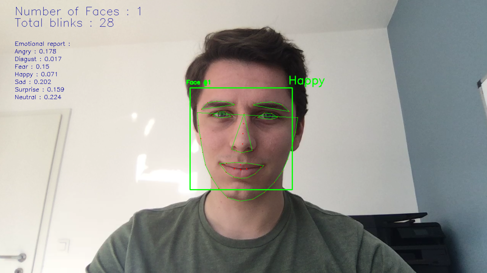

# Facial Emotion Recognition

The aim of this section is to explore facial emotion recognition techniques from a live webcam video stream.

The data set used for training is the Kaggle FER2013 emotion recognition data set : https://www.kaggle.com/c/challenges-in-representation-learning-facial-expression-recognition-challenge/data

## Files

The different folders that can be found in this repo :
- `Notebook_Images` : A set of pictures saved from the notebooks for the final report
- `Test_Images` : A set of pictures used to test the pipeline of image treatment
- `Model_Images` : Models structures saved using `plot_model`
- `Resources` : Some resources that have to used to build the notebooks
- `Other_Notebooks` : Notebooks that have been created but were not used in the final version
- `Emoji` : A group of Emojis used to display the emotion in the live prediction version
- `emotionaldan` : A folder dedicated to Deep Alignment Network 

We'll now cover into more details what each notebook contains :
- `00-Fer2013.ipynb` : Gathers all the work
- `1-Pre-Processing.ipynb` : Transform the initial CSV file into train and test data sets
- `2-HOG_Features.ipynb` : A manual extraction of features such as Histograms of Oriented Gradients and Landmarks
- `3-Pre-Processing-EmotionalDAN.ipynb` : An implementation of Deep Alignment Networks to extract features
- `4-LGBM.ipynb` : Use of classical Boosting techniques on top on flatenned image or auto-encoded image
- `5-Simple_Arch.ipynb` : A simple Deep Learning Architecture
- `6-Inception.ipynb` : An implementation of the Inception Architecture
- `7-Xception.ipynb` : An implementation of the Xception Architecture
- `8-DeXpression.ipynb` : An implementation of the DeXpression Architecture
- `9-Prediction.ipynb` : Live Webcam prediction of the model

The Model weights can be found on this public drive :
*Link to Come*

## Performance

The set of emotions we are trying to predict are the following :
- Happiness
- Sadness
- Fear
- Disgust
- Surprise
- Neutral
- Anger

|       Features                          |   Accuracy    |    Frames/s   | 
|-----------------------------------------|---------------|---------------|
| LGBM on flat image                      |     29.0%     |               |
| LGBM on auto-encoded image              |     39.2%     |               |
| SVM on HOG Features                     |     48.2%     |               |
| SVM on Facial Landmarks features        |     50.5%     |               |
| SVM on Facial Landmarks and HOG features|     50.5%     |               |
| Simple Deep Learning Architecture       |     50.5%     |               |
| Inception Architecture                  |     50.5%     |               |
| Xception Architecture                   |     50.5%     |               |
| DeXpression Architecture                |     50.5%     |               |

