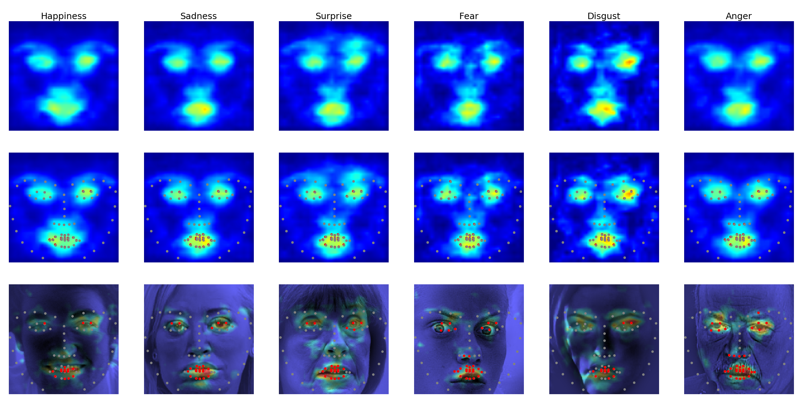

# EmotionalDAN

This repository contains code supporting publication `Classifying and Visualizing Emotions with Emotional DAN` (https://arxiv.org/abs/1810.10529) 

We propose a new approach to solve emotion recognition task that relies on incorporating facial landmarks as a part of the classification loss function. To that end, we extend a recently proposed Deep Alignment Network (https://github.com/MarekKowalski/DeepAlignmentNetwork) with a term related to facial features. Thanks to this simple modification, our model called EmotionalDAN is able to outperform state-of-the-art emotion classification methods on two challenging benchmark dataset by up to 5%. Furthermore, we visualize image regions analyzed by the network when making a decision and the results indicate that our EmotionalDAN model is able to correctly identify facial landmarks responsible for expressing the emotions.



## Requirements

To run the code you need:

* Tensorflow 1.8 or newer
* OpenCV 3.1.0 or newer

Some parts of the code use the following Tensorflow implementation of DAN:
https://github.com/mariolew/Deep-Alignment-Network-tensorflow

## Data preparation

To read the training data run:

```ReadList('train.txt', 'Trainset', isTrainSet=True)```, where `train.txt` is in the following format:
```path_to_jpg_image class_label``` 


## Visualizations


## Citation 

If you use this software in your research, then please cite one of the following papers:

I. Tautkute and T. Trzcinski : Classifying and Visualizing Emotions with Emotional DAN

I. Tautkute and T. Trzcinski and A. Bielski: I Know How You Feel: Emotion Recognition with Facial Landmarks, CVPRW 2018

## Contact

If you have any questions or suggestions feel free to contact me at s16352@pjwstk.edu.pl.